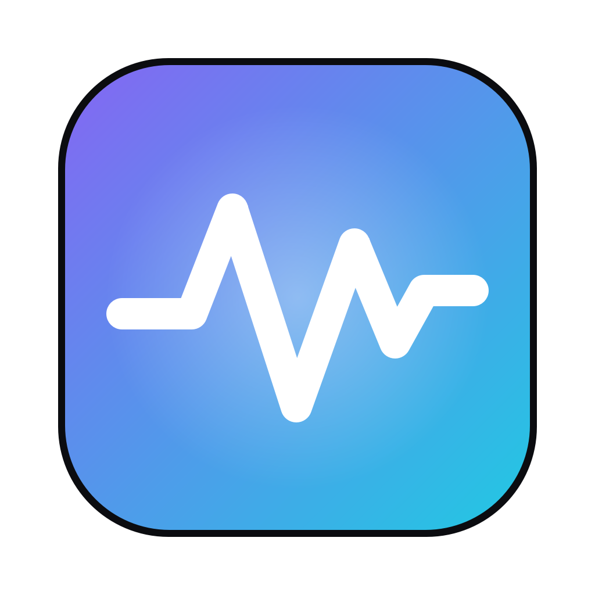
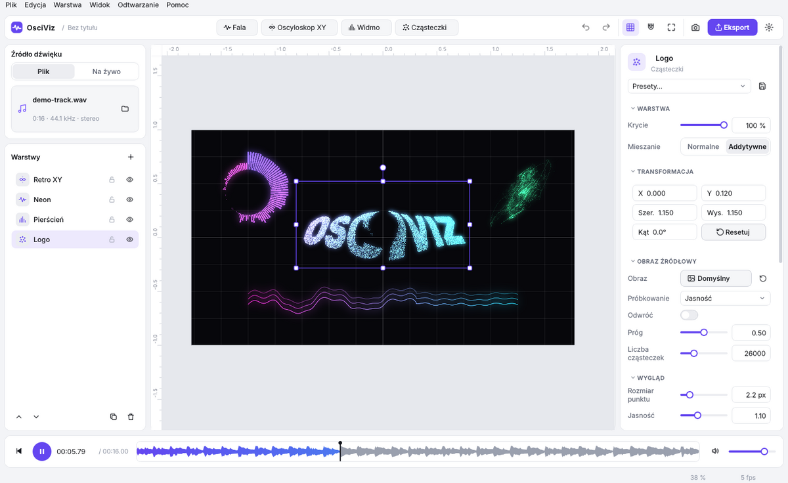
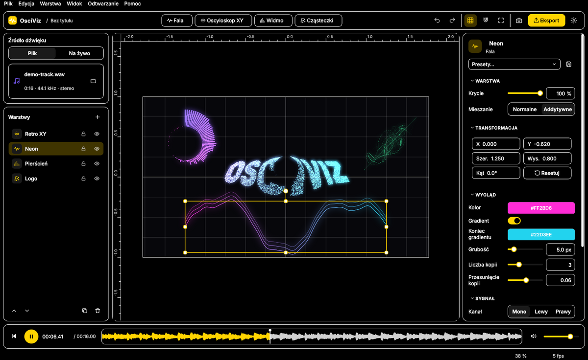

<p align="center">
  
</p>

<h1 align="center">OsciViz</h1>

<p align="center">
  Programowy oscyloskop i edytor wizualizacji audio dla macOS.<br>
  Projekt zaliczeniowy z przedmiotu <b>Grafika Komputerowa i GUI</b>.
</p>


Układasz na płótnie warstwy reagujące na dźwięk — przebieg czasowy, oscyloskop XY, widmo FFT
i obraz rozbity na cząsteczki — edytujesz je myszą i klawiaturą, oglądasz podgląd na żywo
(z pliku albo prosto z FL Studio) i eksportujesz wynik do PNG lub MP4 z dźwiękiem.

## Funkcje

- **4 typy warstw**: fala (z wyzwalaniem jak w oscyloskopie), XY z powidokiem lampy CRT,
  widmo (słupki, lustro, pierścień), cząsteczki z obrazu wypychane przez bas.
- **Układ współrzędnych 2D** z siatką, linijkami, osiami i przyciąganiem; proporcje
  1:1, 16:9, 9:16, 4:3, 5:4, 21:9; kadr eksportu niezależny od widoku.
- **Interakcja**: zaznaczanie (klik, Shift, prostokąt), przesuwanie, uchwyty skalowania
  (Shift — proporcje, Alt — od środka) i obrotu (⌘ — co 15°), menu kontekstowe,
  pełne **cofnij/ponów** dla każdej edycji.
- **Renderowanie OpenGL 4.1** (moderngl): grube linie z trójkątów, MSAA 4×, poświata (Gauss
  w dwóch przebiegach), powidok, mieszanie addytywne, Retina.
- **Na żywo z FL Studio** przez BlackHole, z automatycznym wykrywaniem urządzenia i nagrywaniem sesji do WAV.
- **Projekt `.osv`** (ZIP z audio i obrazami, zapis atomowy, walidacja, migracje),
  **presety warstw** `.json`, **eksport PNG 4K i MP4** (H.264 + AAC, do 4K/60 fps, w tle, z anulowaniem).
- **Motywy**: ciemny, jasny, wysoki kontrast. **Języki**: polski i angielski — przełączane bez restartu.
- **Projekt demonstracyjny** z syntetyczną muzyką przy pierwszym uruchomieniu.

| Motyw jasny | Wysoki kontrast |
|---|---|
|  |  |

## Uruchomienie

Wymagany macOS 13+ (Apple Silicon lub Intel) i Python 3.12.

```bash
git clone https://github.com/jabol71/osciviz.git
cd osciviz
python3.12 -m venv .venv
source .venv/bin/activate
pip install -r requirements.txt
python -m osciviz
```

Gotową aplikację `.app` buduje workflow **Build macOS app** (zakładka Actions → *Run workflow*,
albo automatycznie po wypchnięciu tagu `v1.0.0`). Lokalnie:
`pip install pyinstaller && pyinstaller packaging/osciviz.spec --noconfirm`.

## Dokumentacja

- **Instrukcja obsługi**: [pierwsze kroki](docs/user-guide/getting-started.md) ·
  [interfejs](docs/user-guide/interface.md) · [warstwy](docs/user-guide/layers.md) ·
  [przechwytywanie z FL Studio](docs/user-guide/live-capture.md) ·
  [projekty i eksport](docs/user-guide/export.md) · [skróty](docs/user-guide/shortcuts.md)
- **Dokumentacja techniczna**: [architektura](docs/technical/architecture.md) ·
  [audio](docs/technical/audio.md) · [analiza FFT](docs/technical/analysis.md) ·
  [scena i macierze](docs/technical/scene.md) · [cząsteczki](docs/technical/particles.md) ·
  [renderowanie](docs/technical/render.md) · [GUI, motywy, i18n](docs/technical/gui.md) ·
  [zapis i eksport](docs/technical/io.md) · [budowanie i testy](docs/technical/build.md)

Całość jako strona: `pip install mkdocs-material && mkdocs serve`.

## Rozwój

```bash
pip install -r requirements-dev.txt
pytest          # 40 testów: transformacje, FFT, bufor, obraz→punkty, fizyka, .osv, undo, render
ruff check .
```

Specyfikacja projektu: [CLAUDE.md](CLAUDE.md). Wszystkie etapy z sekcji 12 są zrealizowane.

## Stos

Python 3.12 · PySide6 · moderngl (OpenGL 4.1 Core) · numpy · soundfile · sounddevice ·
OpenCV · Pillow · imageio-ffmpeg · pytest · ruff · PyInstaller · MkDocs
