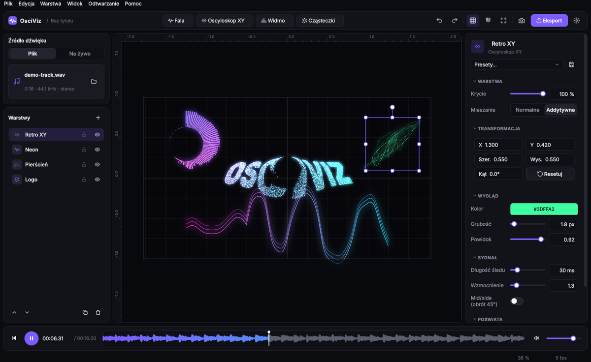

# Interfejs

| Obszar | Do czego służy |
|---|---|
| **Pasek górny** | Dodawanie warstw, cofnij/ponów, siatka, przyciąganie, dopasowanie widoku, zrzut PNG, **Eksport**, ustawienia |
| **Źródło dźwięku** (lewy górny) | Przełącznik **Plik / Na żywo**. Plik: nazwa, długość, częstotliwość. Na żywo: wybór urządzenia, nasłuch, nagrywanie REC |
| **Warstwy** (lewy dolny) | Lista warstw — najwyższa na górze. Oko = widoczność, kłódka = blokada edycji. Dwuklik zmienia nazwę, przeciąganie zmienia kolejność |
| **Płótno** (środek) | Podgląd na żywo. Jaśniejszy prostokąt to **kadr eksportu**; to, co poza nim, jest przyciemnione i nie trafi do pliku |
| **Inspektor** (prawy) | Parametry zaznaczonej warstwy, a bez zaznaczenia — ustawienia płótna |
| **Oś czasu** (dół) | Play/pauza, czas, miniatura przebiegu (kliknij, aby przewinąć), głośność |

## Płótno i układ współrzędnych

- Krótszy bok kadru ma zakres **−1…1**, dłuższy jest wydłużony proporcjonalnie
  (16:9 → X od −1,78 do 1,78). Oś Y rośnie w górę. Linijki na krawędziach pokazują te współrzędne.
- Dzięki temu projekt wygląda **identycznie w każdej rozdzielczości** eksportu.
- Widok (zoom, przesunięcie) jest niezależny od kadru: przybliżenie nie zmienia tego, co wyeksportujesz.
- **Siatka** (G) ma regulowany krok w panelu Płótno; **przyciąganie** (magnes) wyrównuje
  pozycję przeciąganej warstwy do siatki.

## Edycja warstw myszą

| Akcja | Efekt |
|---|---|
| Klik | Zaznacz warstwę |
| Shift + klik | Dodaj / usuń z zaznaczenia |
| Przeciąganie po pustym | Zaznaczanie prostokątem |
| Przeciąganie warstwy | Przesuń (Shift — tylko w jednej osi) |
| Uchwyty narożne / boczne | Skaluj (Shift — zachowaj proporcje, Alt — od środka) |
| Okrągły uchwyt nad warstwą | Obróć (⌘ lub Ctrl — co 15°) |
| Kółko / szczypanie gładzika | Zoom względem kursora |
| Dwa palce na gładziku, środkowy przycisk, Spacja + przeciąganie | Przesuń widok |
| Prawy przycisk | Menu: duplikuj, usuń, wyżej/niżej, reset, presety |
| Dwuklik na pustym | Dopasuj kadr do okna |

Każdą zmianę można cofnąć (⌘Z / Ctrl+Z) — także przeciąganie suwaka czy uchwytu, które cofa się jako jeden krok.

## Ustawienia

Ikona koła zębatego (⌘, / Ctrl+,) otwiera ustawienia: **motyw** (ciemny, jasny, wysoki kontrast)
i **język** (polski, angielski). Zmiana działa od razu, bez restartu, i jest zapamiętywana.
